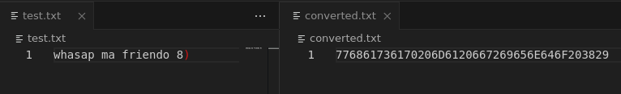
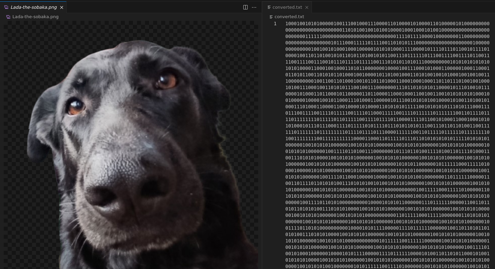

# ftoc - Simple File Converter

The `ftoc` program is written in C and is designed to convert an input file of any form into a binary/hexadecimal string written to the output file `converted.txt`.

## Build

The build is performed via the `build.sh` script.

``` bash
./build.sh
```

After assembly, an executable file **ftoc** is created.

## Usage

The program takes two arguments:

``` bash
./ftoc <mode> <path_to_input_file>
```

-   `<mode>` --- a string parameter that determines the conversion type:
-   `-b` - for binary, `-h` - for hexadecimal
-   `<path_to_input_file>` --- path to the source file to be converted.

#### Examples:

``` bash
./ftoc -h test.txt
```


``` bash
./ftoc -b Lada-the-sobaka.png
```

As a result of execution, a file `converted.txt` is created with the converted contents.